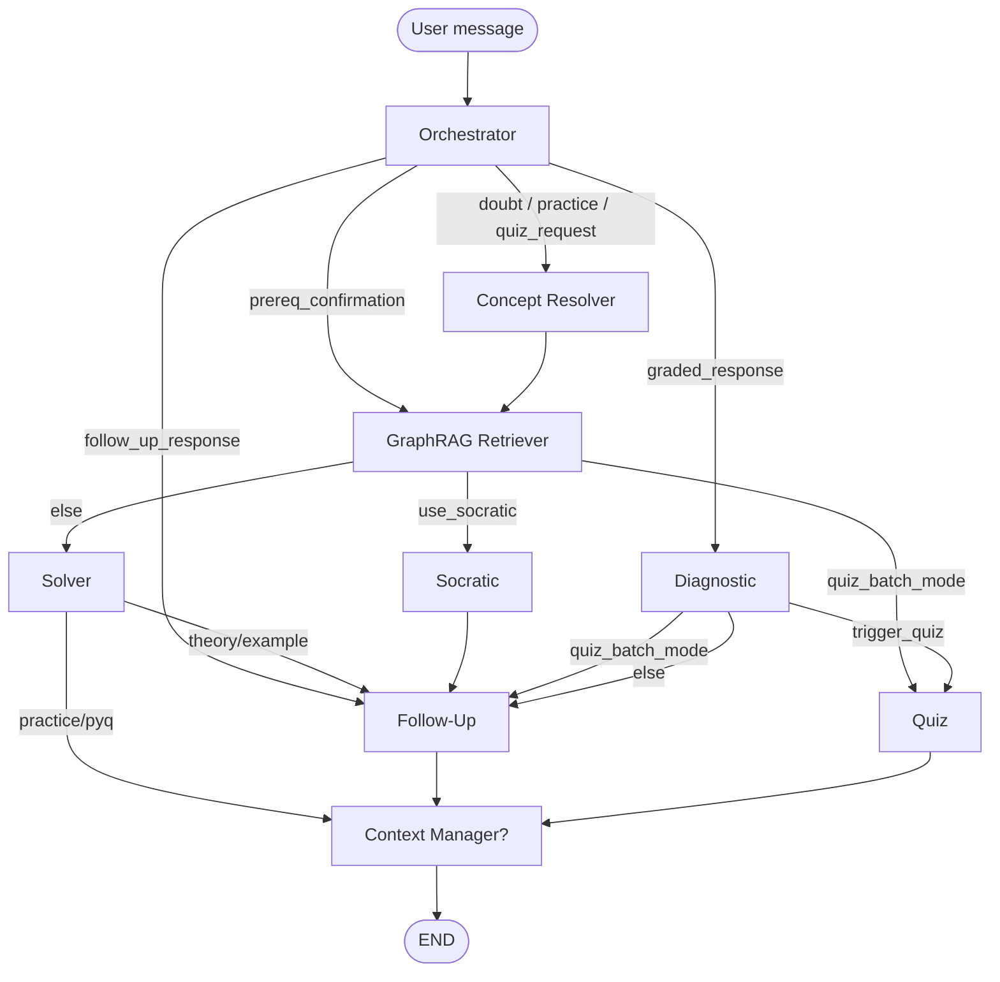

# PrepWise — JEE Tutor Agent

A multi-agent, LangGraph-based AI tutoring system for **JEE Main** and **JEE Advanced Physics**. The agent retrieves curriculum-aligned content from a knowledge graph, adapts responses to student proficiency, tracks learning outcomes, and serves theory explanations, practice questions, PYQs, and on-demand quizzes through a conversational interface.

Built as part of **PrepWise** in collaboration with **KodeinKGP, IIT Kharagpur**.

---

## Table of Contents

1. [High-Level Architecture](#high-level-architecture)
2. [Repository Structure](#repository-structure)
3. [The Nine Agents](#the-nine-agents)
4. [LangGraph Workflow & Intent Routing](#langgraph-workflow--intent-routing)
5. [TutorState — Shared Pipeline State](#tutorstate--shared-pipeline-state)
6. [GraphRAG Retrieval Pipeline](#graphrag-retrieval-pipeline)
7. [LLM Models & Fallback Chains](#llm-models--fallback-chains)
8. [Output Formatting & Parsing](#output-formatting--parsing)
9. [Practice / PYQ Grading Flow](#practice--pyq-grading-flow)
10. [Cross-Turn Memory (Carry State)](#cross-turn-memory-carry-state)
11. [Data Layer — Supabase & Neo4j](#data-layer--supabase--neo4j)
12. [HTTP & Frontend Integration](#http--frontend-integration)
13. [Setup & Local Development](#setup--local-development)
14. [Environment Variables](#environment-variables)
15. [Publishing to GitHub](#publishing-to-github)
16. [Key Configuration Thresholds](#key-configuration-thresholds)

---

## High-Level Architecture

```
┌─────────────────────────────────────────────────────────────────────────┐
│                         Student (Browser / CLI)                          │
└───────────────────────────────┬─────────────────────────────────────────┘
                                │
              ┌─────────────────┴─────────────────┐
              │                                   │
     Next.js Frontend                    main.py (CLI)
     (Aeropt-frontend-main)              api_server.py (FastAPI :8001)
              │                                   │
              └─────────────────┬─────────────────┘
                                │
                    tutor_graph.invoke(TutorState)
                                │
              ┌─────────────────┴─────────────────┐
              │         LangGraph Agent Pipeline       │
              │  Orchestrator → Concept Resolver →     │
              │  GraphRAG Retriever → Solver/Socratic/ │
              │  Quiz → Diagnostic → Follow-Up →       │
              │  Context Manager                       │
              └─────────────────┬─────────────────┘
                                │
         ┌──────────────────────┼──────────────────────┐
         │                      │                      │
    Supabase              Neo4j Aura              Groq + Gemini
  (PostgreSQL)         (Graph + Vectors)      (LLMs + Embeddings)
```

| Component | Technology | Role |
|-----------|------------|------|
| Agent orchestration | **LangGraph** | Wires 9 agents into conditional execution paths |
| Chat LLMs | **Groq** | Intent classification, generation, diagnostics, summarization |
| Embeddings | **Google Gemini** (`gemini-embedding-2`) | Query vectorization for semantic search |
| Relational DB | **Supabase** | Users, sessions, chat history, content, proficiency |
| Graph DB | **Neo4j Aura** | Concept prerequisites, content coverage, vector index |
| HTTP gateway | **FastAPI** | Exposes the agent to the Next.js frontend |
| Frontend | **Next.js** | Study Session UI, auth, dashboard |
| Analytics API | **Django REST** (`Aeropt-backend-main`) | Separate analytics backend (port 8000) |

---

## Repository Structure

```
JEE TUTOR AGENT/
├── agents/                  # All LangGraph agent node implementations
│   ├── orchestrator.py      # Intent classification, session bootstrap
│   ├── concept_resolver.py  # Maps query → concept_id + content_type
│   ├── graphrag_retriever.py# Neo4j graph + vector search + Supabase fetch
│   ├── solver.py            # Direct answers + practice/PYQ formatting
│   ├── socratic.py          # Guiding questions for struggling students
│   ├── diagnostic.py        # Proficiency scoring, error classification
│   ├── follow_up.py         # Suggestions, weak-prereq surfacing, quiz advance
│   ├── quiz.py              # On-demand quiz batch + struggle micro-quiz
│   └── context_manager.py   # Rolling session summarization
├── graph/
│   └── workflow.py          # LangGraph StateGraph definition & routing
├── models/
│   └── state.py             # TutorState TypedDict schema
├── db/
│   ├── supabase_client.py   # All Supabase read/write operations
│   └── neo4j_client.py      # Neo4j graph traversals & vector search
├── utils/
│   └── llm.py               # Groq retry + model fallback wrapper
├── config.py                # Models, thresholds, API keys (from .env)
├── main.py                  # CLI entry point + carry-state management
├── api_server.py            # FastAPI HTTP gateway (port 8001)
├── create_vector_index.py   # One-time Neo4j vector index setup
├── requirements.txt         # Python dependencies
├── Aeropt-frontend-main/    # Next.js frontend
└── Aeropt-backend-main/     # Django analytics backend (separate app)
```

---

## The Nine Agents

| Agent | File | LLM? | Responsibility |
|-------|------|------|----------------|
| **Orchestrator** | `agents/orchestrator.py` | Yes | Load user/session, classify intent, insert user chat turn, trigger Context Manager |
| **Concept Resolver** | `agents/concept_resolver.py` | Yes | Map query to one of 33 Physics concepts + content type (theory/practice/pyq/example) |
| **GraphRAG Retriever** | `agents/graphrag_retriever.py` | Embedding only | Prerequisite traversal, candidate filtering, vector search, Supabase chunk fetch |
| **Solver** | `agents/solver.py` | Yes* | Generate theory/example answers; format practice/PYQ deterministically |
| **Socratic** | `agents/socratic.py` | Yes | Ask guiding questions instead of direct answers when prerequisites are strong but target is weak |
| **Diagnostic** | `agents/diagnostic.py` | Yes** | Update proficiency scores, classify errors, write attempts, trigger struggle quiz |
| **Follow-Up** | `agents/follow_up.py` | No | Surface next suggestions, weak prereqs, follow-up selections, quiz batch advance |
| **Quiz** | `agents/quiz.py` | Yes*** | On-demand quiz batch (deterministic) or struggle-triggered micro-quiz (LLM) |
| **Context Manager** | `agents/context_manager.py` | Yes | Compress chat history into rolling session summary every N interactions |

\* Solver uses **no LLM** for practice/PYQ — responses are built directly from Supabase fields.  
\** Diagnostic LLM is used only for error-type classification on incorrect answers.  
\*** Quiz batch mode (`quiz_request` intent) is **deterministic**; LLM is used only for struggle micro-quizzes.

---

## LangGraph Workflow & Intent Routing

Entry point is always **Orchestrator**. Routing is defined in `graph/workflow.py`.

### Intents (classified by Orchestrator)

| Intent | Trigger example | Path |
|--------|-----------------|------|
| `doubt` | "Explain torque" | Concept Resolver → GraphRAG → Solver/Socratic → Follow-Up |
| `practice_request` | "Give me a practice question on Newton's 2nd law" | Concept Resolver → GraphRAG → Solver → *(skip Follow-Up until graded)* |
| `quiz_request` | "Quiz me on angular momentum", "Give me 3 quiz questions on torque" | Concept Resolver → GraphRAG → Quiz (batch) |
| `graded_response` | Student replies `1` or `0` after practice/PYQ | Diagnostic → Follow-Up (suggestions or weak prereq) |
| `prereq_confirmation` | "Yes" after weak prereq suggestion | GraphRAG → Solver/Socratic *(Concept Resolver skipped)* |
| `follow_up_response` | Student picks suggestion 1/2/3 | Follow-Up (shows selected content) |
| `quiz_response` | Answer during struggle micro-quiz | Diagnostic → Quiz or Follow-Up |

### Workflow diagram



### Socratic vs Solver routing

Decided inside **GraphRAG Retriever** (`_should_use_socratic`):

- **Solver** if: cold start, or prerequisites not strong enough, or Socratic turn limit reached
- **Socratic** if: `prereq_avg > 0.7` AND `target_proficiency < 0.4` AND `socratic_turns < 3`

---

## TutorState — Shared Pipeline State

Every agent receives and returns partial updates to `TutorState` (`models/state.py`).

Key fields:

| Field | Set by | Purpose |
|-------|--------|---------|
| `intent` | Orchestrator | Which pathway to take |
| `primary_concept_id` | Concept Resolver / Orchestrator | Target concept |
| `content_type_requested` | Concept Resolver | theory / practice / pyq / example |
| `retrieved_chunks` | GraphRAG Retriever | Full content rows from Supabase |
| `prereq_concept_states` | GraphRAG Retriever | Prerequisite proficiency + hop count |
| `use_socratic` | GraphRAG Retriever | Route to Socratic vs Solver |
| `response` | Solver / Socratic / Follow-Up / Quiz | Text shown to student |
| `awaiting_graded_response` | Solver / Follow-Up / Quiz | Practice/PYQ pending 1/0 answer |
| `has_graded_outcome` / `is_correct` | main.py / api_server.py | Graded 1/0 submission |
| `pending_prereq_concept_id` | Follow-Up | Weak prereq awaiting confirmation |
| `quiz_batch_mode` / `quiz_batch_index` | Orchestrator / Quiz / Follow-Up | On-demand multi-question quiz state |
| `quiz_batch_size` | Orchestrator | Requested quiz count (1–5) |
| `follow_up_suggestions` | Follow-Up | Next content suggestions |
| `prior_session_summary` | Orchestrator (turn 1) | Cross-session memory |
| `run_context_manager` | Orchestrator | Summarize when interaction_count % 5 == 0 |

---

## GraphRAG Retrieval Pipeline

Fixed 5-step order (do not reorder):

```
1. Concept Resolution     ← primary_concept_id already in state
2. Neo4j REQUIRES traversal → prerequisite concept IDs (up to 2 hops)
3. Neo4j COVERS filter    → candidate content_ids (type, exam, difficulty)
4. Neo4j vector search    → semantic ranking within candidates (top_k=5)
5. Supabase fetch         → full chunk text, images, formulae, solutions
```

- **Embeddings:** Gemini `gemini-embedding-2` embeds the student query
- **Vector index:** `content_vector_index` in Neo4j
- **Prerequisite enrichment:** Each prereq concept is joined with `user_concept_state` from Supabase to compute weighted prereq proficiency

---

## LLM Models & Fallback Chains

All Groq calls go through `utils/llm.py` → `groq_complete()`:

1. Try primary model (up to 2 retries on transient errors)
2. Fall through fallback chain on capacity/timeout/decommission
3. Raise only when entire chain fails

### Primary models (`config.py`)

| Agent | Primary model |
|-------|---------------|
| Orchestrator, Concept Resolver, Diagnostic, Context Manager | `llama-3.1-8b-instant` |
| Solver | `qwen/qwen3-32b` |
| Socratic | `llama-3.3-70b-versatile` |
| Quiz (struggle micro-quiz) | `qwen/qwen3-32b` |
| GraphRAG Retriever | Gemini `gemini-embedding-2` (no chat LLM) |

### Fallback chains

**Solver & Quiz:**
```
qwen/qwen3-32b → qwen/qwen3.6-27b → llama-3.3-70b-versatile → meta-llama/llama-4-scout-17b-16e-instruct
```

**Socratic:**
```
llama-3.3-70b-versatile → meta-llama/llama-4-scout-17b-16e-instruct → llama-3.1-8b-instant
```

**Orchestrator, Concept Resolver, Diagnostic, Context Manager** (`SMALL_MODEL_FALLBACK`):
```
llama-3.1-8b-instant → llama-3.3-70b-versatile → meta-llama/llama-4-scout-17b-16e-instruct
```

---

## Output Formatting & Parsing

The system uses a mix of **LLM-generated** and **deterministic** output formatters.

### LLM output cleaning

| Location | What it does |
|----------|--------------|
| `utils/llm.py` | `min_chars` guard — retries if response is empty or think-only |
| `agents/solver.py` | Strips ``/`<thinking>` blocks from Qwen output |
| `agents/quiz.py` | Same think-block removal + JSON extraction for micro-quiz steps |
| `agents/concept_resolver.py` | Regex JSON extraction from resolver LLM output |
| `agents/orchestrator.py` | Fuzzy substring match on intent label |

### Deterministic formatters (no LLM)

| Formatter | File | Used for |
|-----------|------|----------|
| `_format_practice_response()` | `solver.py` | Practice/PYQ: question → separator → solution → formulae → 1/0 prompt |
| `_format_quiz_batch()` | `quiz.py` | On-demand quiz: all questions then all answers |
| `_format_practice_item()` | `follow_up.py` | Practice/PYQ served via follow-up selection |
| `_render_math_text()` | `solver.py` | Wraps bare LaTeX in `$$…$$` for KaTeX rendering |
| `_formulae_block()` | `solver.py` | Splits `latex_formulae_*` on `\|`, `\n`; wraps each expression in `$$` |
| `_normalize_latex_output()` | `solver.py` | Converts stray literal `\n` in LLM output to real newlines |
| `_image_urls()` | `solver.py` | Builds Supabase Storage URLs; handles comma-separated `image_filename` pairs |

### Frontend rendering

- **Markdown + KaTeX:** `react-markdown`, `remark-math`, `rehype-katex` in `ChatWorkspace.tsx`
- **CSS:** `katex/dist/katex.min.css` imported in `globals.css`

---

## Practice / PYQ Grading Flow

Practice questions and PYQs share the **identical** flow:

```
1. Solver serves question + solution (solution below a scroll separator)
2. Student attempts offline, then replies:
     1  →  correct
     0  →  incorrect
3. main.py / api_server.py detects 1/0 ONLY when awaiting_graded_response=True
4. Diagnostic updates proficiency in user_concept_state
5. Follow-Up:
     correct  → suggestions for next content
     incorrect → weak prerequisite surfaced (prereq_confirmation flow)
```

There is **no MCQ A/B/C/D mechanic**. PYQs and practice questions both use 1/0 self-evaluation exclusively.

---

## Cross-Turn Memory (Carry State)

LangGraph starts with a fresh state on every invocation. `main.py` and `api_server.py` maintain an **in-memory carry dict** keyed by `session_id` so critical fields persist across HTTP requests:

- Always carried: `primary_concept_id`, `content_type_requested`, `prior_session_summary`, `seen_follow_up_ids`
- Carried only while `awaiting_graded_response=True`: `retrieved_chunks`, `prereq_concept_states`, `target_concept_state`
- Quiz batch: `quiz_batch_mode`, `quiz_batch_index`, `quiz_batch_chunks`
- Follow-up: `follow_up_suggestions`, `pending_prereq_concept_id`

**Session summary (cross-session):** Context Manager writes `sessions.session_summary` every 5 interactions. Orchestrator loads the most recent prior summary on the first turn of a new session.

**Limitation:** Carry state is in-memory only — lost on server restart. Acceptable for local dev; production should use Redis or Supabase-backed session state.

---

## Data Layer — Supabase & Neo4j

### Supabase tables

| Table | Purpose |
|-------|---------|
| `users` | Profile: target_exam, preferred_depth, email |
| `sessions` | interaction_count, session_summary, active_quiz |
| `chat_turns` | Full conversation log (role, content, agent_used) |
| `concepts` | 33 JEE Physics concepts (closed-set for resolver) |
| `content` | Questions, theory, PYQs with LaTeX, images, solutions |
| `user_concept_state` | Per-concept proficiency, struggle_streak, error distribution |
| `user_attempts` | Individual graded attempts with error type and timing |

All Supabase access is centralized in `db/supabase_client.py`.

### Neo4j graph

| Element | Purpose |
|---------|---------|
| `Concept` nodes | 33 concepts with `concept_id` |
| `Content` nodes | Content items with vector embeddings |
| `REQUIRES` edges | Prerequisite relationships (traversed up to 2 hops) |
| `COVERS` edges | Content → concept mapping |
| `content_vector_index` | Vector similarity search over content embeddings |

All Neo4j access is centralized in `db/neo4j_client.py`. The graph is **read-only at runtime** (populated offline during ingestion).

### Image storage

Diagrams are stored in Supabase Storage bucket `physics-diagrams` (configurable via `SUPABASE_STORAGE_BUCKET`).

- Core/question image: e.g. `PHY-LOM-PQ-084.png`
- Solution image: e.g. `PHY-LOM-PQ-084_sol.png`
- Some rows store both filenames comma-separated in `image_filename`

---

## HTTP & Frontend Integration

### FastAPI agent server (`api_server.py` — port 8001)

| Endpoint | Method | Purpose |
|----------|--------|---------|
| `/api/v1/chat/message` | POST | Send one message, get agent response |
| `/api/v1/chat/end-session` | POST | Flush session summary on session end |
| `/api/v1/auth/register` | POST | Create user account |
| `/api/v1/auth/login` | POST | Email/password login |
| `/api/v1/auth/user/{user_id}` | GET | Fetch user profile |

**Chat request:**
```json
{ "user_id": "uuid", "session_id": "uuid-or-null", "query": "Explain torque" }
```

**Chat response:**
```json
{
  "session_id": "uuid",
  "response": "…",
  "agent_used": "solver",
  "follow_up_suggestions": [ … ],
  "awaiting_graded_response": false,
  "error": null
}
```

### Next.js frontend (`Aeropt-frontend-main`)

- Study Session UI: `src/components/ChatWorkspace.tsx`
- Auth state: `localStorage` keys (`prepwise_user_id`, `prepwise_auth`, etc.)
- Env: `NEXT_PUBLIC_CHAT_API_BASE` → FastAPI base URL

### Django analytics backend (`Aeropt-backend-main` — port 8000)

Separate REST API for analytics/dashboard metrics. Not part of the agent pipeline.

---

## Setup & Local Development

### Prerequisites

- Python 3.11+
- Node.js 18+
- Accounts: Supabase, Neo4j Aura, Groq, Google AI (Gemini)

### 1. Python agent

```bash
cd "JEE TUTOR AGENT"
python -m venv .venv
.venv\Scripts\activate        # Windows
pip install -r requirements.txt
```

Create a `.env` file (see [Environment Variables](#environment-variables)).

**CLI mode:**
```bash
python main.py --user-id <your-user-uuid>
```

**HTTP mode (for frontend):**
```bash
python -m uvicorn api_server:app --host 127.0.0.1 --port 8001 --reload
```

### 2. Next.js frontend

```bash
cd Aeropt-frontend-main
npm install
```

Create `.env.local`:
```
NEXT_PUBLIC_CHAT_API_BASE=http://127.0.0.1:8001
NEXT_PUBLIC_API_BASE=http://127.0.0.1:8000
```

```bash
npm run dev
```

Open `http://localhost:3000`.

### 3. Django analytics backend (optional)

```bash
cd Aeropt-backend-main
pip install -r requirements.txt
python manage.py runserver
```

---

## Environment Variables

Create a `.env` file in the project root (never commit this file):

```env
# Neo4j Aura
NEO4J_URI=neo4j+s://xxxx.databases.neo4j.io
NEO4J_USER=neo4j
NEO4J_PASSWORD=your-password

# Supabase
SUPABASE_URL=https://xxxx.supabase.co
SUPABASE_KEY=your-service-role-or-anon-key
SUPABASE_STORAGE_BUCKET=physics-diagrams

# LLM APIs
GROQ_API_KEY=your-groq-key
GEMINI_API_KEY=your-gemini-key
```

---

## Publishing to GitHub

### Before you push

**Never commit secrets.** Add a `.gitignore` at the repo root:

```gitignore
.env
.env.local
.env.*.local
__pycache__/
*.pyc
.venv/
node_modules/
.next/
*.log
.DS_Store
```

**Safe to commit:** all source code, `requirements.txt`, `.env.example` (with placeholder values, no real keys).

**Review before push:**
- `.env` — contains API keys → **exclude**
- `Aeropt-frontend-main/.env.local` — exclude
- Supabase service role key — exclude
- Any CSV dumps with real user data — review and exclude if sensitive

### Suggested GitHub repo structure

Push the entire `JEE TUTOR AGENT` folder as the repository root. Suggested repo name: `prepwise-jee-tutor-agent` or `jee-tutor-agent`.

```bash
git init
git add .
git commit -m "Initial commit: JEE Tutor Agent multi-agent architecture"
git remote add origin https://github.com/<your-username>/<repo-name>.git
git push -u origin main
```

### README for recruiters / reviewers

This README documents:
- The 9-agent LangGraph architecture
- GraphRAG retrieval design
- LLM model assignments and fallback resilience
- Practice/PYQ adaptive grading flow
- Full stack integration (FastAPI + Next.js + Supabase + Neo4j)

---

## Key Configuration Thresholds

Defined in `config.py`:

| Parameter | Value | Effect |
|-----------|-------|--------|
| `NEO4J_VECTOR_TOP_K` | 5 | Max chunks retrieved per query |
| `NEO4J_PREREQ_DEPTH` | 3 | Max hops for prereq traversal (graph uses 2 in practice) |
| `WEAK_THRESHOLD` | 0.4 | Proficiency below this → flagged_weak |
| `CLEAR_WEAK_THRESHOLD` | 0.65 | Proficiency above this + 2 correct → clear weak flag |
| `PROFICIENCY_WMA_ALPHA` | 0.7 | Weight on old score in moving average |
| `SOCRATIC_PREREQ_MIN` | 0.7 | Min prereq avg to trigger Socratic mode |
| `SOCRATIC_TARGET_MAX` | 0.4 | Max target proficiency for Socratic mode |
| `SOCRATIC_MAX_TURNS` | 3 | Auto-escalate to Solver after this many Socratic turns |
| `STRUGGLE_STREAK_QUIZ_TRIGGER` | 3 | Consecutive wrong answers → struggle micro-quiz |
| `CONTEXT_MANAGER_EVERY_N` | 5 | Summarize session every N interactions |

---

## License

Add your license here before publishing (e.g. MIT, Apache 2.0, or proprietary if this is a private AerOpt/KodeinKGP project).

---

## Author

**Mohd Hammad Ansari** — AI & agentic architecture, PrepWise / JEE Tutor Agent  
In collaboration with **AerOpt Consulting Pvt. Ltd.** and **KodeinKGP, IIT Kharagpur**
